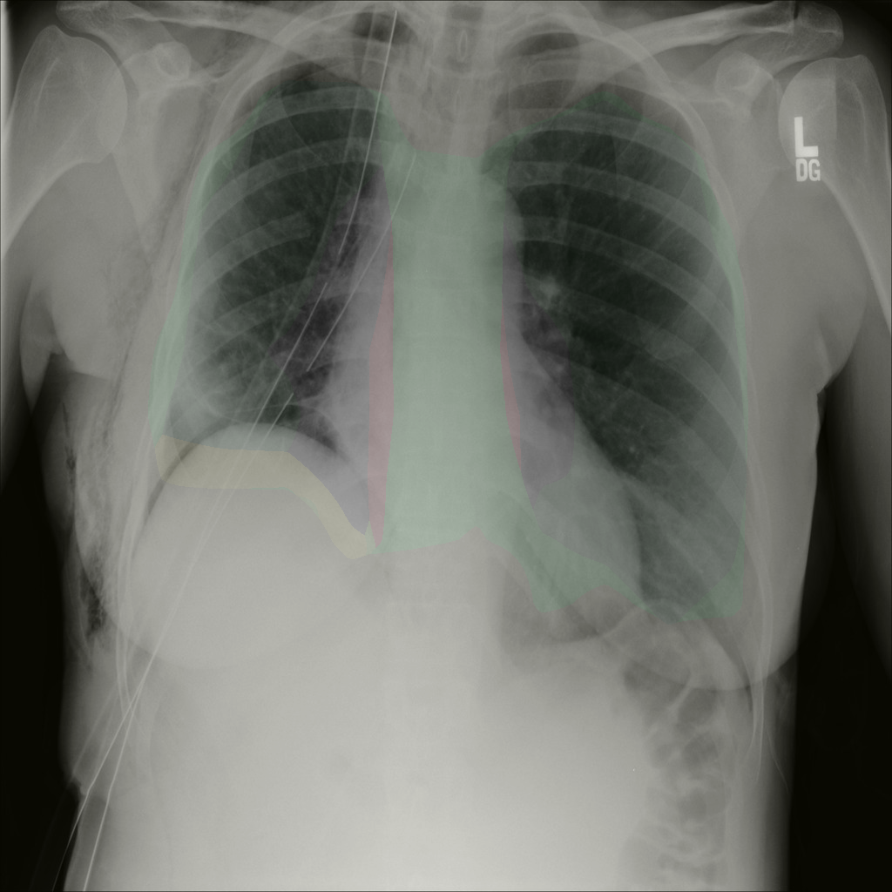

# Optimized Pneumothorax Segmentation

This repository is an optimized and adjusted version of the [sneddy/pneumothorax-segmentation](https://github.com/sneddy/pneumothorax-segmentation) project, which was the first-place solution for the SIIM-ACR Pneumothorax Segmentation competition on Kaggle. The optimizations include using a MOCO-pretrained GroupViT model for initial segmentation to enhance downstream model training effects. Key adjustments involve dataset sampling based on positive/negative ratios, customized data augmentations, and configurable experiment settings via YAML and JSON files.

For research purposes, please cite the original project as recommended in their README. Additional details on the base approach can be found in their video (https://youtu.be/Wuf0wE3Mrxg) and presentation (https://yadi.sk/i/oDYnpvMhqi8a7w).

## Installation

1. Create a Python environment
```
conda create --name MoCoSeg python=3.10
conda activate MoCoSeg
```
2. Install the dependencies:
```
pip install torch==2.4.1 torchvision==0.19.1 torchaudio==2.4.1 --index-url https://download.pytorch.org/whl/cu121
pip install matplotlib scikit-learn pandas tqdm opencv-python segmentation-models-pytorch albumentations transformers
```

Note: This assumes the original dependencies suffice; additional libraries for GroupViT (e.g., via PyTorch) may be needed if not included. Verify compatibility with Python 3.x and GPU support for training.

## Dataset Preparation

The dataset used is the SIIM-ACR Pneumothorax dataset. Assuming images are already in PNG format (if not, refer to the original project's `prepare_png.py` for DICOM-to-PNG conversion).

Before training downstream models, prepare the dataset folds:

1. Use `utils/prepare_existing_png.py` to sample the SIIM-ACR Pneumothorax dataset into 5 folds based on positive/negative sample ratios. This script records each image's fold assignment and whether it contains a lesion (pneumothorax) in a CSV file.

   - This ensures balanced folds for cross-validation.

## Configuration Setup

### Transforms JSON Files

Set up JSON files for transforms at each stage (e.g., train, valid). These control data augmentations and image resizing. Repo examples are under `transforms/`.

- Adjust augmentation methods (e.g., HorizontalFlip, RandomContrast, ElasticTransform via Albumentations) and resize dimensions (e.g., 512x512 or 768x768).
- Example structure for `train_transforms_512_part0.json`:
  ```json
    {
        "__class_fullname__": "albumentations.augmentations.transforms.HorizontalFlip",
        "p": 0.5
    },
    {
        "__class_fullname__": "albumentations.core.composition.OneOf",
        "p": 0.3,
        "transforms": [
          {
            "__class_fullname__": "albumentations.augmentations.transforms.RandomBrightnessContrast",
            "p": 0.5,
            "brightness_limit": 0.2,
            "contrast_limit": 0.2
          },
          {
            "__class_fullname__": "albumentations.augmentations.transforms.RandomGamma",
            "p": 0.5,
            "gamma_limit": [80, 120]
          }
        ]
    },
    {
        "__class_fullname__": "albumentations.augmentations.transforms.Resize",
        "p": 1,
        "height": 512,
        "width": 512,
        "interpolation": 1
    }
  ```
- Create separate files for each phase to fine-tune behaviors.

|  |  |
|:---------------------------:|:-------------------------:|
| Transforms Example 1        | Transforms Example 2       |

### Experiments YAML File

Configure the main experiment settings in `experiments/deeplabv3plus/train_config_deeplabv3plus_partN.yaml`. This controls:
- Model selection (e.g., downstream DeepLabv3plus, U-Net AlbuNet or SEU-Net...).
- Image folder paths.
- Log recording paths.
- Loss functions (e.g., Combo of BCE + Dice + Focal).
- Optimizer (e.g., Adam with LR 1e-4).
- Batch size (e.g., 12 for GPU memory constraints).
- Other hyperparameters like scheduler, epochs.

Example snippet:
```yaml
CRITERION: 
    PY: Losses
    CLASS: ComboLoss
    ARGS: 
        weights:
            bce: 1
            dice: 0.5
            focal: 0.5
OPTIMIZER:
  CLASS: Adam
  ARGS:
    lr: 0.0001
    weight_decay: 0.000005
SCHEDULER:
  CLASS: ReduceLROnPlateau
  ARGS:
    mode: max
    factor: 0.1
    patience: 2
    threshold: 0.0000001
    min_lr: 0.0000001
```

## Usage

### Step 1: Fine-Tune GroupViT for Upstream Segmentation

Use `fine_tune_maker.py` to inference a MOCO-pretrained GroupViT model on the dataset for segmentation. This provides enhanced features for downstream models.

Output visualizations will be saved under a sibling folder (default: `step_set_segmix_v9.0`). Ensure paths inside `fine_tune_maker.py` are configured for your dataset.

|  |  |
|:---------------------------:|:-------------------------:|
| Original Image              | GroupViT Prediction       |


- This step leverages self-supervised pre-training for better initialization.

### Step 2: Train Downstream Models

After upstream fine-tuning and dataset preparation:

- Navigate to `unet_pipeline`.
- Train using configurations that incorporate upstream outputs (e.g., as additional inputs or initial weights).

Similar to original:
```
cd unet_pipeline
python Train.py experiments/train_config_part0.yaml  # Incorporate upstream features
```

- Repeat for multiple parts/stages, adjusting sample rates and image size (e.g., sliding from 0.8 to 0.4, 512x512->768x768).
- Use 5-fold cross-validation based on prepared CSV.

### Inference and Submission

- Inference: `python visualize_triplet_processing.py`

<p align="center">
  <br>
  CP1
</p>

<p align="center">
  <br>
  CP2
</p>

Outputs include checkpoints, mask probabilities.

## Key Optimizations and Features

- **Upstream GroupViT**: Enhances downstream training via pre-segmentation features.
- **Ratio-Based Folding**: Balances positive/negative samples across 5 folds for robust validation.
- **Customizable Transforms and Experiments**: JSON/YAML for flexible augmentations and hyperparameters.
- Inherits original features like Triplet Scheme, Combo Loss, and checkpoint averaging.

## Acknowledgment
Thanks to the original project and the community for providing high-quality baselines and discussions!